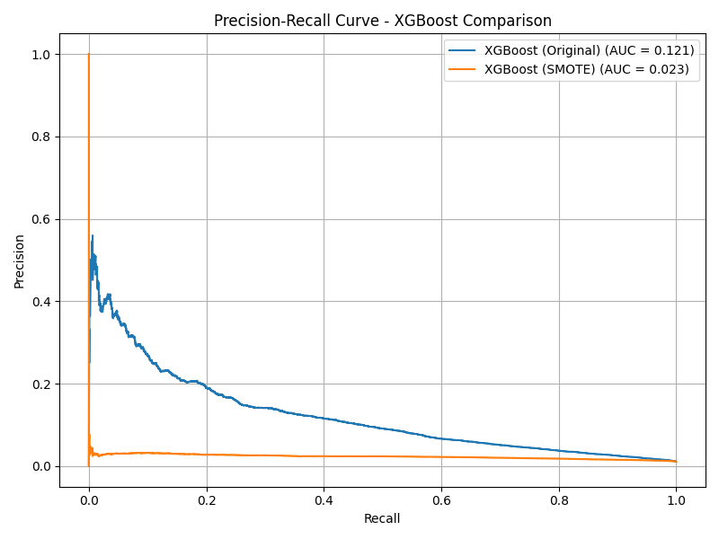

# Credit Card Fraud Detection Analysis

Comprehensive classification analysis using the Feedzai BAF synthetic credit card fraud dataset. This project evaluates techniques for detecting fraud in highly imbalanced financial data using Logistic Regression, XGBoost, and LightGBM models. Class balancing strategies like SMOTE and `scale_pos_weight` are tested for impact on model performance, supported by exploratory data analysis and visualization. Key performance metrics such as the Precision-Recall Curve, direct model comparisons using Precision, Recall, and F1 scores, and recommendations are included to inform fraud mitigation strategies.

---

## Purpose

This project aims to build interpretable and high-recall models to detect fraudulent credit card applications. Special attention is paid to class imbalance handling and business-friendly evaluation metrics (precision-recall curves, confusion matrices). Models are evaluated based on their ability to correctly identify fraud while maintaining manageable false positive rates.

---

## Dataset Overview

- **Source:** Feedzai BAF Dataset Suite
- **Kaggle:** [https://www.kaggle.com/datasets/sgpjesus/bank-account-fraud-dataset-neurips-2022](https://www.kaggle.com/datasets/sgpjesus/bank-account-fraud-dataset-neurips-2022?select=Base.csv)
- **GitHub:** [https://github.com/feedzai/bank-account-fraud](https://github.com/feedzai/bank-account-fraud/tree/main?tab=readme-ov-file)
- **Target Variable:** `fraud_bool` (1 = Fraud, 0 = Not Fraud)
- **Size:** ~1 million applications
- **Fraud Rate:** ~1.1% of records are labeled as fraud

---

## Tech Stack

- **Python** (Pandas, Scikit-learn, XGBoost, LightGBM, Seaborn, Matplotlib, Imbalanced-learn)
- **Jupyter Notebook** (EDA, Modeling, Visualization)
- **GitHub Pages + Jekyll** (Project portfolio publishing)

---

## Key Questions Answered

### 1. Which features help predict whether an application is fraudulent?
### 2. Can machine learning models effectively detect fraud in highly imbalanced data?
### 3. Which class balancing technique performs best for tree-based models?

---

## Featured Visualizations

### Fraud Class Distribution

- Fraudulent applications represent only **1.1%** of all cases, illustrating extreme class imbalance and the need for advanced resampling or weighting strategies.
- Classification models like XGBoost or LightGBM could be excellent methods for accurately predicting fraud incidence in our data.

### Categorical Features (Log Scale by Fraud Status)
Disclaimer: The variables Housing Status, Employment Status, and Payment Type have been anonymized to preserve customer privacy. Although their categorical labels do not reflect real-world semantics, they retain predictive value and may still indicate patterns associated with fraudulent credit card applications.

  
  - Fraud is prevalent on Windows operating system compared to other OS'.
  
  - CA employment status has an unusually high number of frauds.
  
  - Fraud counts are noticeably higher for BA and BB compared to other housing status.
  - Fraud is especially rare in BG, BF, BD, even though these have decent non-fraud counts.
  
  - AB and AC payment type both show strong fraud representation relative to their non-fraud base.
  - AE payment type has almost no fraud presence despite having many non-fraud cases.

  
  - Fraud via Internet source has significantly greater quantity of both fraud and non-fraud cases relative to Teleapp
  - Deductions involving fraud prevalence by source cannot be confidently made, however it can be assumed through this data that the majority of both fraudulent and non-fraudulent applications occur via  the internet.

### KDE Plot - Numerical Features by Fraud Status

- Features like `credit_risk_score` and `velocity_6h` showed strong separation between fraud and non-fraud classes.
- Non-fraudulent applications tend to have a lower credit risk score than fraudulent ones.
- Both frauduluent and non-fraudulent applications tend to have similar 6 hour, 24 hour, and 4 week velocities, in addition to similar session length and zip-count.
  - This may seem like an innocous finding at first, however this informs us greatly about the densely clustered values among fraudulent application samples. As the data is highly skewed towards non-fraudulent applications, then intuitively the fraudulent samples' KDE peaks will inherently be lower. Therefore, for our plots that have comparable KDE peaks across fraudulent and non-fraudulent samples, the feature in question are strong indicators of fraud.

### Correlation Heatmap

- Most of the features show weak or near-zero correlation with fraud_bool, indicating limited linear association with fraud occurrence.
- A few features, such as velocity_6h, velocity_24h, and intended_balcon_amount, indicate moderate positive correlation with fraud, suggesting potential relevance for predictive modeling.
- Overall, this heatmap reinforces our need to go beyond linear correlation and apply additional methods to assess predictive value.

### Precision-Recall Curve - Logistic Regression

- SMOTE increased recall from 1% to 77% but at the cost of a precision drop to 5% (17 false positives compared to 35,219).
- The introduction of the SMOTE oversampling technique resulted in our Logistic Regression casting an aggressively wide net around our data and misclassifying a significant proportion of non-fraudulent applications as fraudulent.
- Both curves drop quickly as recall increases, showing that the models struggle to maintain precision when trying to identify more fraud cases.

### Precision-Recall Curve - XGBoost

- SMOTE resulted in an unusably high false positive rate, demonstrated by the noticeably abysmal recall rate in our orange curve.
- Model ran on SMOTE-altered data indicates extremely high sensitivity to fraud, classifying 130,066 non-fraudulent applications as fraudulent.
- Model trained on the original data performs significantly better than XGBoost trained on SMOTE-altered data — it maintains a better balance between catching fraud and not overwhelming the system with false positives.
- The original model is more conservative, yet far more trustworthy and usable for fraud detection in real-world applications.

#### Why does SMOTE hurt our XGBoost model?
- Synthetic points, as in the case of our oversampling technique in SMOTE, adds a lot of "noise" in the form of newly generated fraud samples, which can mislead the tree growth process.
- Our XGBoost model is incredibly vulnerable to synthetic patterns generated by SMOTE due to it being a high-capacity learner - these patterns don't generalize uniformly to the rest of the data, leading to a precipitous drop in precision score.

### Precision-Recall Curve - LightGBM

- Our LightGBM model with SMOTE applied decimatea our fraud recall estimates. It's precision hovers near zero across all recall levels, meaning that almost all fraud predictions are false alarms.
- Weighted LightGBM delivered the most balanced output. Precision steadily declines with increasing recall, which is expected. The model is cautious, but when it flags fraud, it's relatively accurate early on.

### Precision-Recall Curve - Weighted LightGBM vs XGBoost

- **LightGBM with `scale_pos_weight`** achieved the highest overall PR AUC (0.162) with strong recall (0.79), outperforming all other models.
- Both models massively outperform their SMOTE counterparts, proving that scale_pos_weight is the superior approach for decision trees.
- Our LightGBM model correctly identifies 163,218 non-fraudulent applications and only misclassifies 34,576 legitimate applications as fraud, a drastic improvement from the 197,411  legitimate applications misclassified as fraud in our SMOTE-altered data.
- Our XGboost model received a significant tune-up in performance, although not quite as good as our LightGBM model, demonstrated clearly in the consistently lower precision rates over the recall range.
- Our XGboost model correctly identifies 179,305 non-fraudulent applications and only misclassifies 1,324 legitimate applications as fraud, also a drastic improvement from the 130,066 legitimate applications misclassified as fraud in our SMOTE-altered data.

---

## Model Comparison and Results

### Logistic Regression
- **Original:** Recall 0.01, Precision 0.64, F1 0.03
    - Out of all fraud applications, 64% of the predictions were correct (recall, only 30 applications). Recall is at an abysmal 0.01, meaning we caught only 1% of fraudulent applications. F-1 score indicates a terrible balance of precision and recall ~ 0.03. Overall accuracy, at 0.99, is misleading since our data is inherently significantly skewed.
- **SMOTE:** Recall 0.77, Precision 0.05, F1 0.09
    - Out of all fraud applications, 5% of the predictions were correct (recall, 1692 applications). Recall is at a much improved 0.77, meaning we caught up to 77% of fraudulent applications. F-1 score indicates a subpar balance of precision and recall ~ 0.09. Overall accuracy, at 0.82, is underwhelming and worse-off than our logistic regression completed with non-SMOTE training data. Our Smote data allowed our model to catch much more fraudulent transactions, however its casting a much, much wider net, resulting in false positives.
      
### XGBoost
- **Original:** Recall 0.03, Precision 0.41, F1 0.06
    - Although precision for the fraud class looks better than in Logistic Regression, recall remains extremely low — the model still missed 97% of fraud. The f1-score is low (0.06), indicating poor fraud detection. Accuracy remains high at 0.99, but again, this is misleading due to the dataset imbalance.
- **SMOTE:** Recall 0.90, Precision 0.02, F1 0.03
    - This version of XGBoost is extremely sensitive to fraud — catching almost all of it — but at the cost of flagging the majority of normal transactions incorrectly. The model has high recall but extremely poor precision and overall usability, reflecting an overly aggressive fraud detection behavior after SMOTE oversampling.
- **Weighted:** Recall 0.60, Precision 0.07, F1 0.12
  - Here, precision on fraud predictions improved to 7%, and recall rose to 0.60, meaning 60% of fraud was successfully identified — a major step up from the original XGBoost performance. With an F1-score of 0.12 and accuracy of 0.90, this version of XGBoost strikes a better balance, delivering strong fraud recall without the excessive false alarms seen in the SMOTE model.
 
### LightGBM
- **Original:** Recall 0.05, Precision 0.42, F1 0.08
- **SMOTE:** Recall 0.99, Precision 0.01, F1 0.02
    - Our model misclassified a staggering 197,411 legitimate applications as fraud, a total decimation of its predictive power and precision rate. Despite its ability to detect nearly every fraud case, the model’s overall accuracy collapsed to 0.01, making it unusable in practice. The F1-score (0.02) shows that the model performs terribly in balancing fraud detection and false alarms.
- **Weighted:** Recall 0.79, Precision 0.05, F1 0.09
    - Out of all fraud applications, only 5% of predicted frauds were correct (precision), but recall jumped to 0.79, meaning we caught nearly 80% of actual fraud cases. The F1-score of 0.09 reflects a modest but real improvement in balancing fraud detection with false positives. Although the accuracy dropped to 0.82, this is a worthwhile tradeoff for the significant increase in fraud capture — a massive improvement over the SMOTE version.

##### Importantly:
The catastrophic drop in precision caused by the introduction of the SMOTE oversampling technique is a textbook case of tree models overfitting to synthetic patterns that SMOTE produces. Because LightGBM and XGBoost build decision splits on exact feature values, the interpolated samples from SMOTE inaccurately reflect the true structure of the data. Instead, they introduce unnatural boundaries the model vulnerably focuses on — allowing it to memorize synthetic "fraud zones" that don’t generalize, leading to massive false positive rates.

---

## Final Evaluation: Best Models

| Model                   | Recall | Precision | F1-Score | PR AUC |
|------------------------|--------|-----------|----------|--------|
| **LightGBM (Weighted)** | 0.79   | 0.05      | 0.09     | 0.162  |
| XGBoost (Weighted)      | 0.60   | 0.07      | 0.12     | 0.126  |
| Logistic Regression     | 0.01   | 0.64      | 0.03     | 0.140  |
| LightGBM (SMOTE)        | 0.99   | 0.01      | 0.02     | 0.017  |

---

## How to Reproduce

1. Clone the repository:
```bash
git clone https://github.com/SebastianMarrero/Credit-Card-Fraud-Analysis.git
```
2. Open the notebook `Credit Card Fraud Analysis.ipynb` in Jupyter Lab or VS Code  
3. Run the notebook cells sequentially  
4. View generated visualizations in `/assets/images`  
5. Optional: Customize preprocessing or model tuning parameters

---

## Contact

Created by **Sebastian Marrero**  
Email: sebastianmarrero64@gmail.com  
LinkedIn: [linkedin.com/in/sebastianmarrero](https://linkedin.com/in/sebastianmarrero)
