# Credit Card Fraud Detection Analysis

Comprehensive classification analysis using the Feedzai BAF synthetic credit card fraud dataset. This project evaluates techniques for detecting fraud in highly imbalanced financial data using Logistic Regression, XGBoost, and LightGBM models. Class balancing strategies like SMOTE and `scale_pos_weight` are tested for impact on model performance, supported by exploratory data analysis and visualization. Key performance metrics, model comparisons, and recommendations are included to inform fraud mitigation strategies.

---

## Purpose

This project aims to build interpretable and high-recall models to detect fraudulent credit card applications. Special attention is paid to class imbalance handling and business-friendly evaluation metrics (precision-recall curves, confusion matrices). Models are judged based on their ability to correctly identify fraud while maintaining manageable false positive rates.

---

## Dataset Overview

- **Source:** Feedzai BAF Dataset Suite
- **Kaggle:** [https://www.kaggle.com/datasets/sgpjesus/bank-account-fraud-dataset-neurips-2022](https://www.kaggle.com/datasets/sgpjesus/bank-account-fraud-dataset-neurips-2022?select=Base.csv)
- **GitHub:** [https://github.com/feedzai/bank-account-fraud](https://github.com/feedzai/bank-account-fraud/tree/main?tab=readme-ov-file)
- **Target Variable:** `fraud_bool` (1 = Fraud, 0 = Not Fraud)
- **Size:** ~1 million applications
- **Fraud Rate:** ~1.1% of records are labeled as fraud

---

## Tech Stack

- **Python** (Pandas, Scikit-learn, XGBoost, LightGBM, Seaborn, Matplotlib, Imbalanced-learn)
- **Jupyter Notebook** (EDA, Modeling, Visualization)
- **GitHub Pages + Jekyll** (Project portfolio publishing)

---

## Key Questions Answered

### 1. Which features help predict whether an application is fraudulent?
### 2. Can machine learning models effectively detect fraud in highly imbalanced data?
### 3. Which class balancing technique performs best for tree-based models?

---

## Featured Visualizations

### Fraud Class Distribution
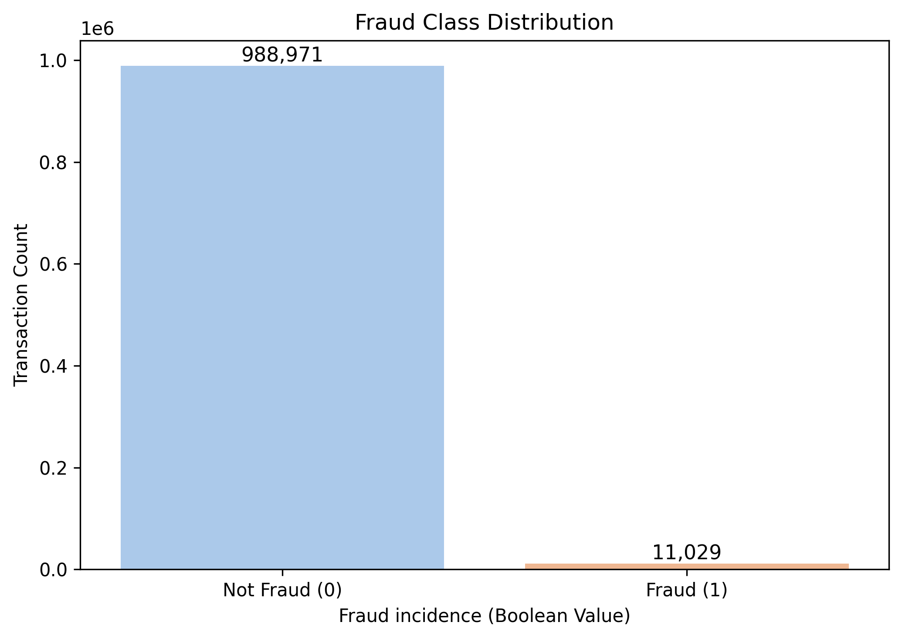
- Fraudulent applications represent only **1.1%** of all cases, illustrating extreme class imbalance and the need for advanced resampling or weighting strategies.

### Categorical Features (Log Scale by Fraud Status)
- 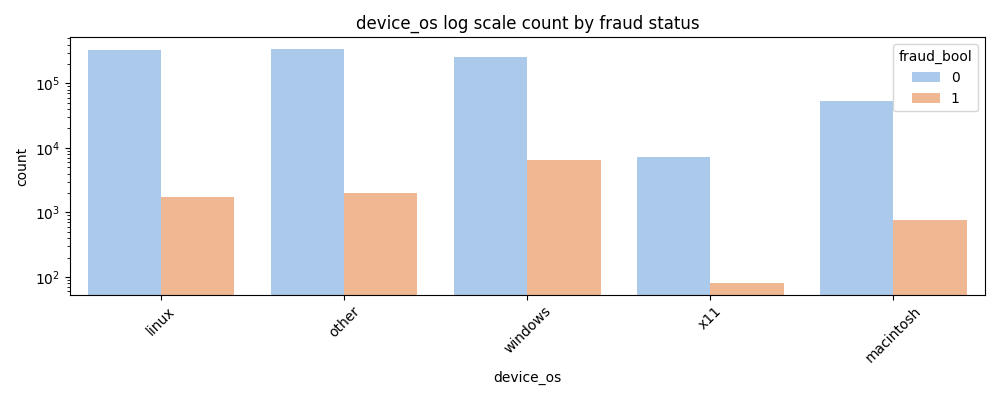  
  - Fraud was more prevalent among users of older or obscure device operating systems.
- 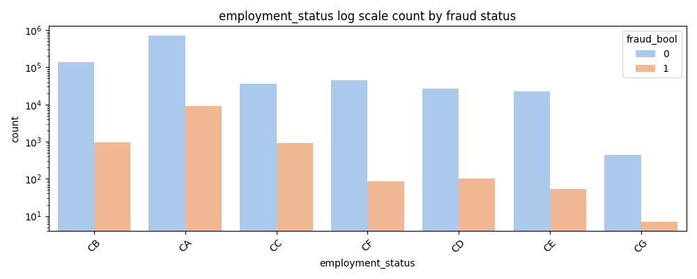  
  - Fraud skewed toward users with missing or unemployed statuses.
- 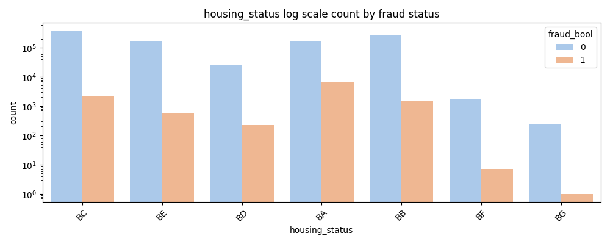  
  - Higher fraud among renters and applicants with ambiguous housing.
- 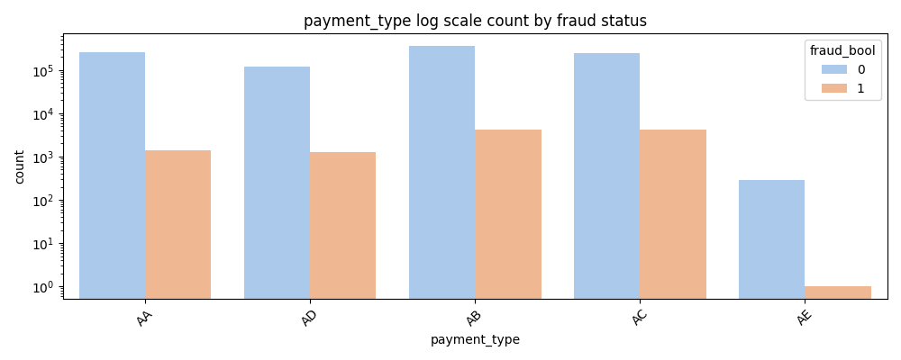  
  - Prepaid methods showed disproportionately higher fraud.
- 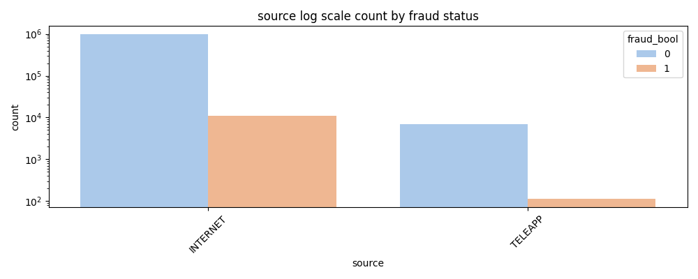  
  - Online sources contributed more fraud than in-person sources.

### KDE Plot - Numerical Features by Fraud Status
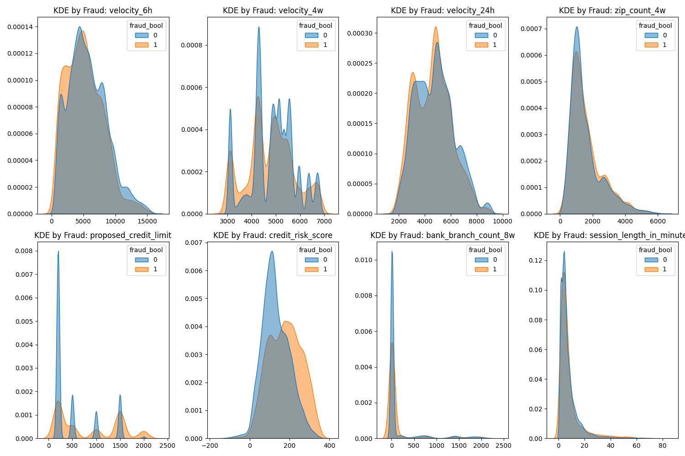
- Features like `credit_risk_score` and `session_length_in_minutes` showed strong separation between fraud and non-fraud classes.

### Correlation Heatmap
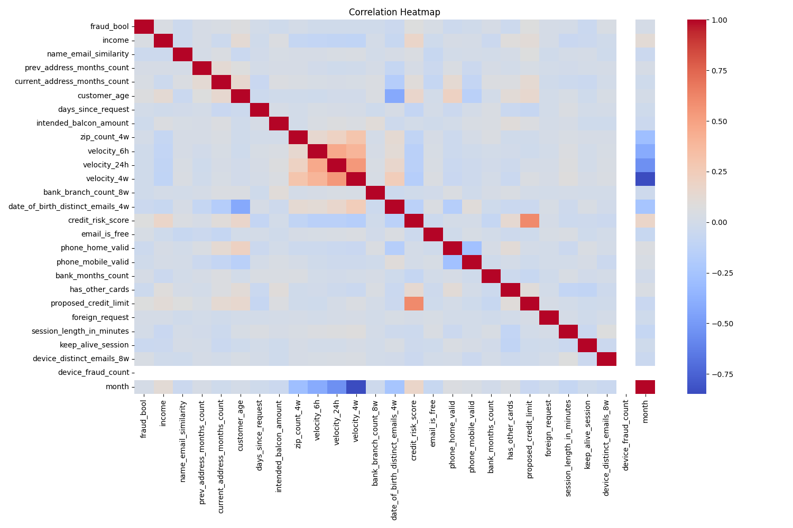
- No multicollinearity issues. Several device/email-related features had moderate correlations with `fraud_bool`.

### Precision-Recall Curve - Logistic Regression
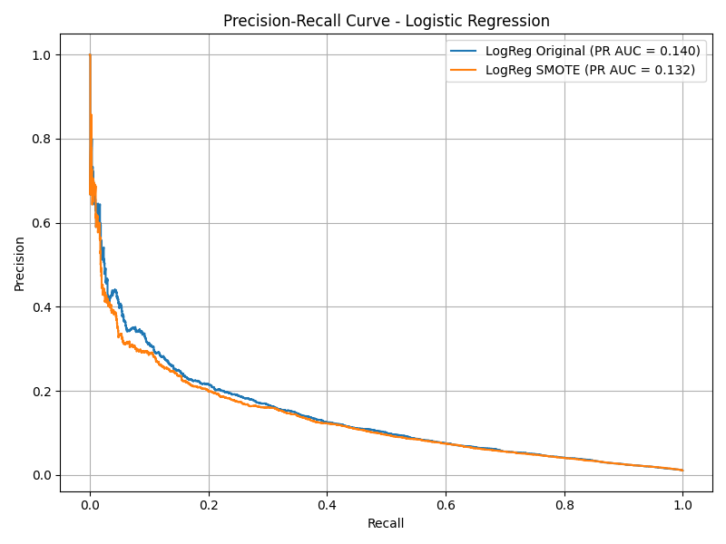
- SMOTE increased recall from 1% to 77% but at the cost of a precision drop to 5%.

### Precision-Recall Curve - XGBoost

- SMOTE resulted in an unusably high false positive rate. Weighted XGBoost achieved better balance: 60% recall, 7% precision.

### Precision-Recall Curve - LightGBM
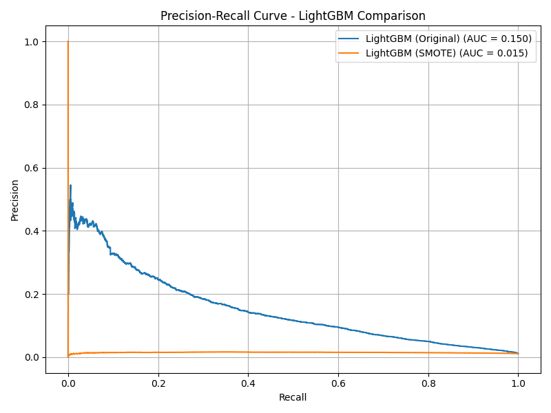
- LightGBM struggled with SMOTE. Weighted LightGBM delivered the most balanced output.

### Precision-Recall Curve - Weighted LightGBM vs XGBoost
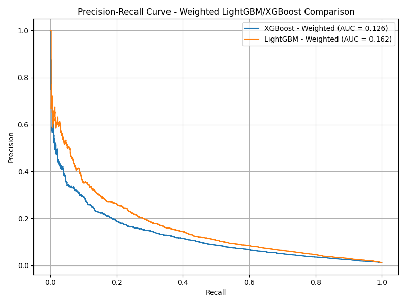
- **LightGBM with `scale_pos_weight`** achieved the highest overall PR AUC (0.162) with strong recall (0.79), outperforming all other models.

---

## Model Comparison and Results

### Logistic Regression
- **Original:** Recall 0.01, Precision 0.64, F1 0.03
- **SMOTE:** Recall 0.77, Precision 0.05, F1 0.09

### XGBoost
- **Original:** Recall 0.03, Precision 0.41, F1 0.06
- **SMOTE:** Recall 0.90, Precision 0.02, F1 0.03
- **Weighted:** Recall 0.60, Precision 0.07, F1 0.12

### LightGBM
- **Original:** Recall 0.05, Precision 0.42, F1 0.08
- **SMOTE:** Recall 0.99, Precision 0.01, F1 0.02
- **Weighted:** Recall 0.79, Precision 0.05, F1 0.09

---

## Final Evaluation: Best Models

| Model                   | Recall | Precision | F1-Score | PR AUC |
|------------------------|--------|-----------|----------|--------|
| **LightGBM (Weighted)** | 0.79   | 0.05      | 0.09     | 0.162  |
| XGBoost (Weighted)      | 0.60   | 0.07      | 0.12     | 0.126  |
| Logistic Regression     | 0.01   | 0.64      | 0.03     | 0.140  |
| LightGBM (SMOTE)        | 0.99   | 0.01      | 0.02     | 0.017  |

---

## How to Reproduce

1. Clone the repository:
```bash
git clone https://github.com/SebastianMarrero/Bank-Account-Fraud-Analysis.git
```
2. Open the notebook `Credit Card Fraud Analysis.ipynb` in Jupyter Lab or VS Code  
3. Run the notebook cells sequentially  
4. View generated visualizations in `/assets/images`  
5. Optional: Customize preprocessing or model tuning parameters

---

## Contact

Created by **Sebastian Marrero**  
Email: sebastianmarrero64@gmail.com  
LinkedIn: [linkedin.com/in/sebastianmarrero](https://linkedin.com/in/sebastianmarrero)
